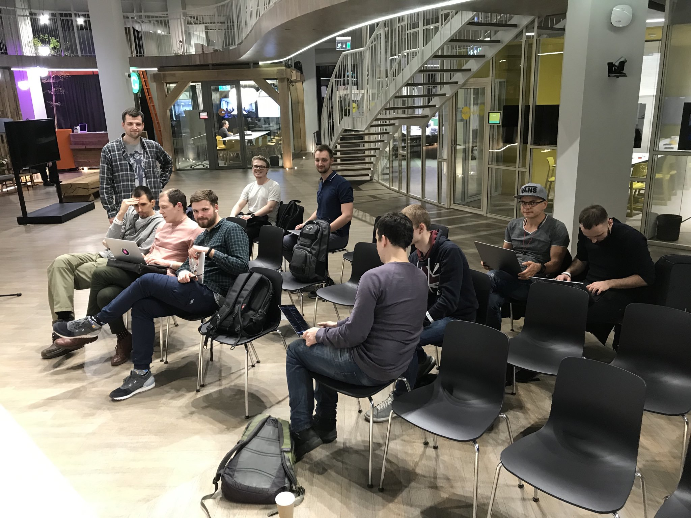
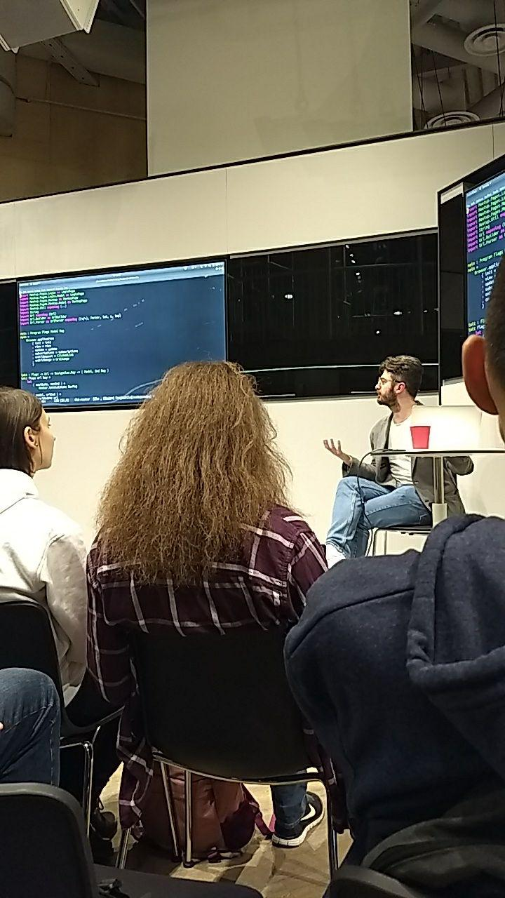

# Kyiv Elm Study Group Experience Report

Last Thursday was our last Study Group meeting. It was an exciting, short experiment, which would hopefully bring Kyiv's Elm community to life.

### Scope

We began on February 28, and the course took seven weeks overall. We went through [Elm in Action](https://www.manning.com/books/elm-in-action) book by Richard Feldman, one chapter a week, composing our own set of exercises. You can see the program at [course's info page](https://github.com/KyivHaskell/elm-study-group#%D1%80%D0%BE%D0%B7%D0%BA%D0%BB%D0%B0%D0%B4) (some more edits planned).

The logo is a play on our [Haskell Group's logo](https://k-bx.github.io/articles/Kyiv-Haskell-Study-Group-Experience-Report.html).

### Initial Plans and Worries

After running a [Haskell Study Group](https://k-bx.github.io/articles/Kyiv-Haskell-Study-Group-Experience-Report.html) last year, I started planning another one but worried about not getting enough participants. Then, once I discovered Elm, it became clear that it might be a great "gateway drug," to run Elm Study Group first, and get more people on board to Haskell. Initially, I thought I could interest a lot of developers from the JS community, but that didn't really work, the group was pretty diverse in terms of their tech background. However, at least two people from the group are already looking forward to joining the Haskell one, so I consider that as a success.

The biggest concern was the lack of homework in both books I've read. Haskell Study Group was based on a book which not only had them but had exercises go through "natural selection" of many revisions and feedback letters. Another was that the books themselves are not only young, but the one we ended up using was (and is) not actually finished yet. This turned out to not be a show stopper since the finished part covers all the major parts you need to know, thanks to Elm being very compact.

At first, I've read the [Practical Elm](https://korban.net/elm/) book, and it turned out to not be a good fit for our study group, but rather a set of practical recipes for more advanced devs. I've then settled on Elm in Action.

Another concern was my general skepticism to "learn by doing" approach, over a potential deception and misunderstanding by making something that works, but in a "monkey see monkey do" approach instead of  having explanation and understanding of an underlying process.

*Sorry for not capturing the whole group, as usual, I forgot about the photo and only did it at the "afterparty" when some people left already.*

### Meetup.events

A peculiar moment was that we were surprisingly denied of hosting our community page at Meetup.com, even though we've had a similar one for Haskell Study Group. So I decided that it's an excellent opportunity to build a small "toy" service built with Haskell and Elm to show a practical use-case for an Elm SPA that we can study during the course. That's how the https://meetup.events was born. It has the link on its Gitlab source code, and our study group events and participants are at <https://meetup.events/index.html#meetup/1>.

### Advanced materials

In addition to the book's course, here the list of materials we went through during our meetups. Usually, it consisted of me doing a presentation in front of the audience as part 1 of our meetup. After that, we were splitting into groups helping each other with homework problems or other things:

- Meetup.events SPA code
- Conduit SPA code by Richard <https://github.com/rtfeldman/elm-spa-example>
- Debug.todo/Debug.log
- elm-format (required everywhere)
- CurrySoftware/elm-datepicker (in homework)
- elm-css
- elm-ui
- elm-tools/parser (motivational example from lib docs that parses boolean expressions)
- barely mentioned: elm-bootstrap, composable-form

### Outcomes

I still think that Elm has a potential of being a much better language for beginners than Haskell because of its simplicity of syntax, lack of type classes except for four special ones, specialized types everywhere, row polymorphism and good type errors. Unfortunately, it is still unfairly unpopular (IMO).

One outcome from the course experience itself is to keep it short; seven weeks feels perfect. Probably put chapter 1+2 together. However, there needs to be a good introductory material on Algebraic Data Types, case-matching, working with lists (understanding them) and recursion. This turned out to be very hard for people who never had experience with functional languages before. This tutorial should serve as a week 1.

Every homework had few "training" exercises to implement some small functions, had one SPA and one additional big problem like n-queens. The first outcome is that it'd probably be better to keep it as a single SPA that would progress every week, rather than a new SPA every time. Secondly, some big problems were too hard, n-queens should go towards the end, and "Graceful Labeling" is just too hard for the course. [Morse code](https://www.codewars.com/kata/decode-the-morse-code/elm) from CodeWars was a great idea. Simple, and you get the points on CodeWars community, will put more next time!

JSON combinators are hard, and I see no clear way dealing with their study except for recommending the Haskell courses where we go slowly through similar things ("applicative" part). One good idea was to reimplement your own json-like library, and few people enjoyed it, though found it still very hard.

Community-wise, I decided to start with Telegram channel instead of Slack to have a more accessible entrance, especially for JS devs which reside on other Telegram channels. This turned out to be a bad idea. Slack, having its "#random" room for off-topic conversations, would be a much better choice, and we migrated there as soon as the course started.

### Personal impression

I have mixed feelings about the course. While some people fell off because of lack of time, I am confident that many people stopped because they didn't have an explanation that's detailed enough. I knew that it would be the way, on the one hand, and asked people to join the Haskell course for that, on the other, it's never a good feeling to see people leaving without grasping the material. I am yet to gather final course feedback, so maybe I'll add more here.

### Acknowledgments

Huge thanks to Viktoria Kolomiets and [Grammarly](https://grammarly.com/) for hosting and supporting us. This course would not be nearly as smooth to run as it was with their support.

Thanks to every participant, no matter how many times you managed to get to us. I was delighted to see so many motivated and interesting people from such a wide variety of backgrounds. Let's try to keep this community alive.

Thanks to Richard for his excellent book, without which there would be no study group.

### Plans

I do hope to run another Elm course once I finish the Haskell one, but no specific dates yet, so please keep in touch and follow our [KyivHaskell](https://mobile.twitter.com/KyivHaskell) twitter for announcements.

Please send your feedback for this post in Issues or PRs in [this blog's repo](https://github.com/k-bx/k-bx.github.io).

