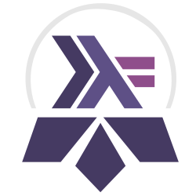
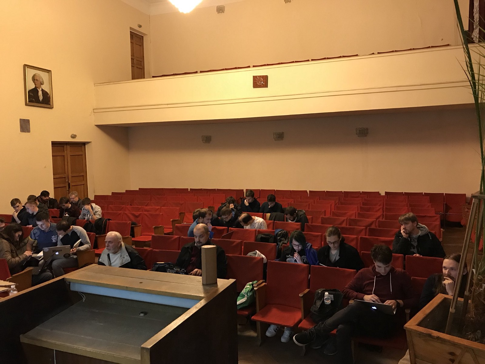
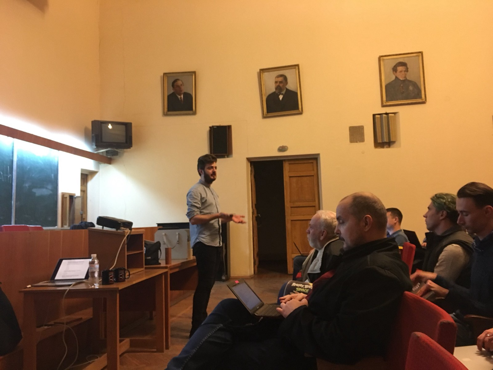

# Kyiv Haskell Study Group Experience Report

While it is still a bit hard for me to realize what happened entirely, the first Kyiv Haskell Study Group came to its completion recently, and now’s the time to look back for a summary and think about our plans for the future.

We began on 17 Oct 2017, and our last meeting was at 20 Mar, so it took five months overall. We worked based on an excellent [course program made by Steven Syrek](https://github.com/sjsyrek/haskell-study-startup), making [our fork](https://github.com/KyivHaskell/haskell-study-group) with Ukrainian translation and edits to keep the course info accurate. You can see the schedule in English [at the bottom](https://github.com/KyivHaskell/haskell-study-group#%D0%A0%D0%BE%D0%B7%D0%BA%D0%BB%D0%B0%D0%B4) of the document. For those who don’t know, it’s a course based on [The Haskell Book](http://haskellbook.com/) and is dedicated to a thoughtful study with a focus on exercises and practice.

### Preparations

The Institute of Mathematics kindly agreed to host our meetups and additionally provided a projector, which was very handy. We’ve been able to reach out to two sponsors, and all the money went to support The Institute.

After launching the page on Meetup.com and a Slack channel, we’ve also made few logos to choose from, which I think is an excellent motivational detail. The winner is a sort of a composition of Haskell’s logo and [Kyiv Metropolitan’s symbol](https://imgur.com/a/eBzsG):

### Group size

First few meetings attracted a larger group, around 20–25 persons, but it quickly reduced to a core group of about 10. As we went, the number of attendees naturally fell off for various reasons. Unfortunately, I didn’t have a good log of the number of attendees ([the meetup page](https://www.meetup.com/Kyiv-Haskell-Learning-Group/events/past/) is the best thing I have). Something like six people finished the Monads chapter, and four made it to the Monad Transformers.

While it might seem like not a significant number, I am pretty happy with these results for few reasons:

- I believe that majority of people who “fell off” aren’t lost in any way, and some might hop into the next Study Group, some might stay in Haskell community regardless
- amount of effort was so significant that I was amazed by every person making every week’s worth of progress

### Program

As Steven suggested, our initial plan was to stop once we cover the Monads chapter not to make the course feel like it “goes forever.” As we reached the Monad chapter, all the group members were willing to continue, and I’m quite happy we covered the Monad Transformers. We could probably finish the book, but I was now the bottleneck, as I started studying at NLP courses myself and went underwater.

We’ve skipped some exercises in favor of focusing on a peer-to-peer review of others, and needless to say, had few moments when we had to adjust the tempo.

### Meetup format evolution

At the first N sessions, I kept an introductory word as short as possible, focusing on people splitting into groups and helping each other with exercises. As everybody worked, I went through all the groups asking people individually of their progress. This approach worked pretty well for big group size and non-advanced topics.

As topics went more complex, we gradually skimmed towards a format of a shared public overview of the chapter with a projector, review of my exercise solutions if I thought something interesting should be articulated or emphasized. I tried not to explain the material, but instead go through my observations thinking out loud. As we had fewer people, the dialogue format felt more consolidating.

### Lessons learned

- the Study Group was surprisingly beneficial for me, even though I was supposed to know all the material, it closed a lot of my knowledge gaps, especially in more advanced topics
- just catching up with the group and hosting the meeting is already a lot of work, and I wouldn’t even bet it will get much easier next time
- education format with a hard focus on homework and practical exercises, and rejection of lectures in favor of problem discussions had brought a real insight to me, and I cannot stop noticing the inferiority of other forms of studying

### Acknowledgments

Huge thank you to all the attendees for their hard work and patience. Thank you, Chris and Julie, for the delightful book, it’s a truly high-quality material. Thank you, Steve, for writing an excellent program with detailed instructions, nothing would happen without it. Thank you Vova and Olga for your moral support and the help finding the sponsors. Thank you, sponsors, Grammarly and Intetics, for moral and financial support. And thank you Institute of Mathematics for hosting us.

### Future and plans

The future looks not entirely clear yet, but interesting for sure. First, we have Kievfprog conference on April 22nd, by that date, I will make my decision when to run the next Study Group and plan to announce that after my talk.

Secondly, Deputy Director of The Institute of Mathematics contacted me with a proposal to onboard students from the Magisterial program they are going to have in a newly-launched University based on The Institute. So, starting from September, I will launch another Study Group with some people attending from there.

And to close up, my primary plan is still to build a healthy Haskell community in Kyiv. This Study Group has been a great experience, I am looking forward to seeing what else is going to happen.