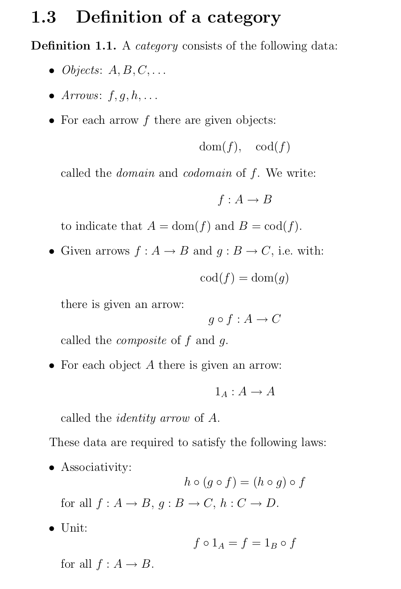

# A Monoid Is a Category With Just One Object. So What's the Problem?

I've finally started studying Category Theory, first step was to rename the directory with materials from "Cathegory" (it was created long time ago). The book I've chosen from [an excellent Quora answer by E. Kmett](https://www.quora.com/What-is-the-best-textbook-for-Category-theory) was "Category Theory" by Steve Awodey.

Chapter 1 hits you with a Category definition, and then a bunch of examples of a Category, one of which caught my attention. First, the Category definition:



Now, an interesting example:

> A monoid (sometimes called a semi-group with unit) is a set M equipped
> with a binary operation · : M × M → M and a distinguished “unit”
> element u ∈ M such that for all x, y, z ∈ M,
> $$
> x · (y · z) = (x · y) · z
> $$
> and
> $$
> u · x = x = x · u
> $$
> Equivalently, a monoid is a category with just one object. The arrows
> of the category are the elements of the monoid. In particular, the
> identity arrow is the unit element u. Composition of arrows is the
> binary operation m · n of the monoid.

As a person coming mostly from the world of Types, I was somewhat confused. Many questions at once:

- "Just one object". Which object? What's its type? Any arbitrary object, no connection with arrows?
- Arrows, they're..not functions. Wouldn't you encode arrows as functions from object to object in Type Theory?
- Category definition says "for each arrow *f* there is a domain `dom(f)`". What's a domain of an arrow if that arrow isn't a function then?

Seems bizarre!

So I decided to (try to) encode it. But before that, I needed to come up with iniail picture in my head, which looked something like this:

TODO: mysterious object and its morphisms as a picture

## Failed attempt in CubicalTT

Initially, I started with [CubicalTT](https://github.com/mortberg/cubicaltt) because that's what I was familiar with from before and which I adore for its minimalism. Unfortunately, minimalism comes at a price of being too bare-bones. I still find it to be a great source for studying HoTT/MLTT, especially because it has so much implemented in its [examples](https://github.com/mortberg/cubicaltt/tree/master/examples) directory, that I've decided to quote its definitions and my failed attempt here. If you don't understand this and want to see Agda -- don't worry! Just skip along.

```Haskell
-- * monoid part

-- A Monoid is a Type that must be a SET and its laws
monoid : U
  = (X : SET) * ismonoid X
-- Monoid laws
ismonoid (M : SET) : U
  = (op : M.1 -> M.1 -> M.1)
  * (_ : isAssociative M.1 op)
  * (id : M.1)
  * (hasIdentity M.1 op id)
-- Reminder on what a SET is in HoTT
-- See lectures by Andrej Bauer for more info https://vimeo.com/330992581
-- collection of all sets (type together with laws)
SET : U = (X:U) * set X
-- for all a and b, their paths are equal (their paths are propositions)
set (A : U) : U = (a b : A) -> prop (Path A a b)
-- level of logic (type with at most
-- one element, for any two elements they are equal)
-- again, see Andrej's lecture series
prop (A : U) : U = (a b : A) -> Path A a b
```

and the category part:

```haskell
-- * category part
-- category is precategory and category laws
category : U = (C:precategory)*isCategory C
-- precategory is categoryData and precategory laws
precategory : U = (C : categoryData) * isPrecategory C
-- category data is object type and a morphism
categoryData : U = (A : U) * (A -> A -> U)
```

I won't quote laws here, but you can see an interesting part here already. Morphisms are represented as a type `A -> A -> U`, e.g. **given two objects**, it will give you a **space of their morphisms**. So, that space of all morphisms should be a type of the elements of our monoid's set. And a type for the object? It should always be the same, no matter what is is really:

```haskell
data BoringMonoid = MkBoringMonoid

monoidToCategoryEx01 (m : monoid) : category
  = ( ( ( BoringMonoid
        , \(bm1:BoringMonoid) -> \(bm2:BoringMonoid) -> m.1.1
        )
      , ( \(x : BoringMonoid) -> m.2.2.2.1 -- monoid.ismonoid.id
        , ? -- c : (x y z : A) -> hom x y -> hom y z -> hom x z
        , ( ? -- homSet
          , ? -- cPathL
          , ? -- cPathR
          , ? -- 
          )
        )
      )
    , ? -- -- (A : cA C) -> isContr ((B : cA C) * iso C A B)
    )

```

Here, you can see something that compiles, with lots of holes for proofs of laws. Implementing proofs of laws in cubicaltt is left as an exercise for the reader!

## Encoding in Agda

Hoping for a bit more user-friendliness and proof assistance, I went with Agda. It's my first experience somewhat seriously working with it, so I had to learn a lot simultaneously, including the [editor setup](https://github.com/k-bx/dotfiles/blob/master/dotemacs.el#L273).

First thing I've noticed in Agda, it has its library just laying around on your file system, as you set its path in `~/.agda/libraries`. Which means that *sources are just there to be opened*. I've found `Monoid` in `agda-stdlib/src/Algebra.agda`, but couldn't find a `Category`.

It turned out there is no `Category` in `agda-stdlib`. Googling a bit had brought me to [copumpkin/categories](https://github.com/copumpkin/categories), but just a little later I've accidentally found the [agda/agda-categories](https://github.com/agda/agda-categories) repo created 12 days ago!

A Category is a record, so the first thing to do was to make a record with holes instead of field values.`Level`s were done mostly by "try until it works" approach, since I haven't worked with them before, but can imagined them being somewhat trivial for our case. Loading in Emacs via `C-c C-l` fills holes with special labels. Interesting!

<video autoplay loop muted playsinline width=400>
  <source src="./boring-monoid-category/scr01.mp4" type="video/mp4">
  <source src="./boring-monoid-category/scr01.webm" type="video/webm">
</video>

- TODO: Agda libs are local, can be loaded in editor. No TAGS support, but jumping back/forward "just works"
- TODO: No category theory, but there's a fresh one in agda repos
- TODO: holes, C-c C-r, C-c C-,, C-c C-., C-c SPC

p.s.: in cased you've missed the folklore, check out [the wonderful StackOverflow explanation of the phrase "A monad is just a monoid in the category of endofunctors, what's the problem?"](https://stackoverflow.com/a/3870310/540810)


