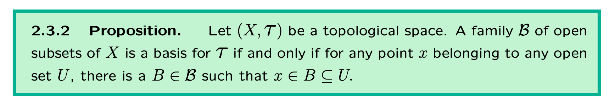
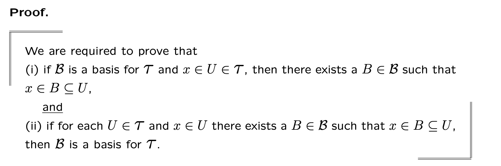
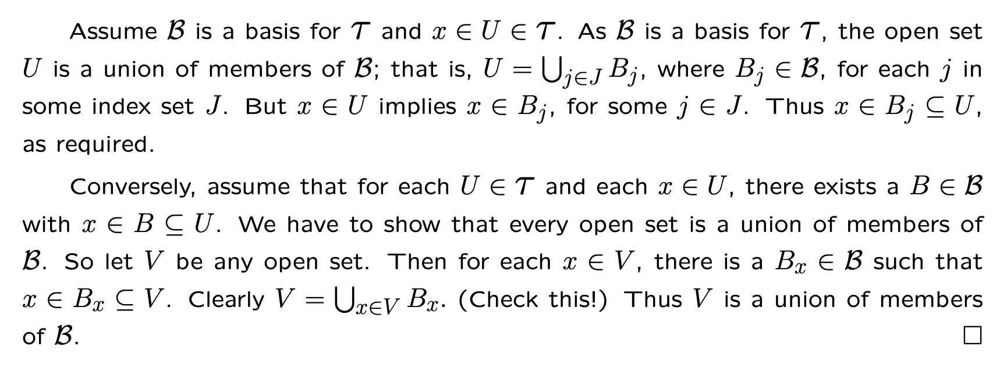
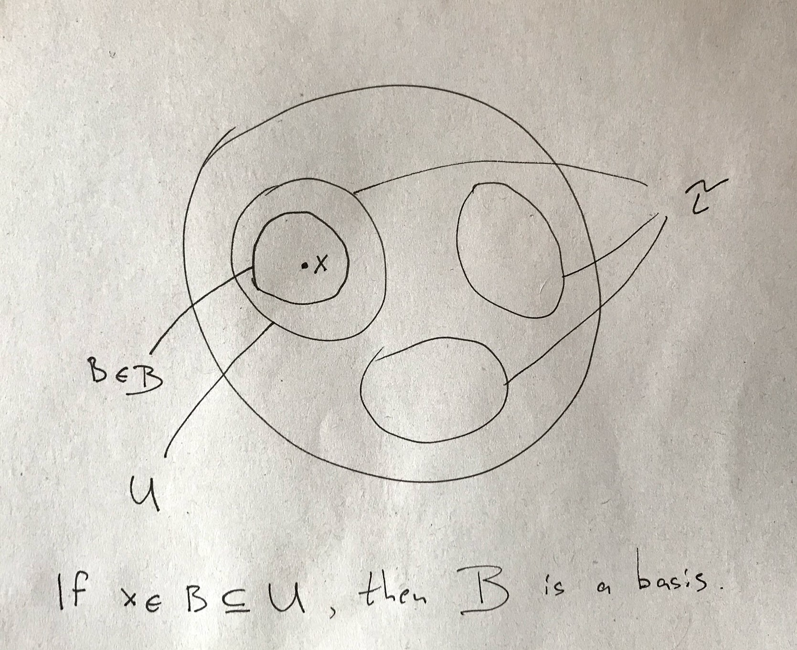

# Propositions as Types: Some Missing Links

I've recently started studying Topology, which turned out to be a topic filled with set theory and theorems around it. Unfortunately, my brain was well-poisoned with Type Theory by the time I've started, so I couldn't help  but itch my hands in an attempt of encoding things in Type Theory.

In this blog post, I will list the things I consider missing (or rarely mentioned) when people are talking about Propositions-as-Types concerning proving set theory theorems in Type Theory and show a simple proof of a theorem from the book "Topology Without Tears", one merely about Topology but rather a set-theoretic exercise in proofs.

## The Missing Links

List of things I don't see mentioned very often:

**Equality of Sets**. If sets are types, then what would their equality look like? I think there are two options here: first is to use the notion of Isomorphism, the second is to assume Univalence and get equality-via-isomorphism "for free". In this post's example, I'll take the former approach. So if we are required to prove that sets `A` and `B` are equal, we will be building an element of type `A ≃ B`. Just to remind ourselves what an Isomorphism is. For some types `A` and `B`, an isomorphism between them is defined as:

```agda
record _≃_ (...) where
  field
    to   : A → B
    from : B → A
    from∘to : ∀ (x : A) → from (to x) ≡ x
    to∘from : ∀ (y : B) → to (from y) ≡ y
```

An Isomorphism is a record of four fields:

- a function taking us from `A` to `B`
- a function bringing us backwards
- an element of type `from (to x) ≡ x`, proving that if we go from `A` to `B` and back using our implementation, we'd get the same element we started from
- and a similar law `to (from y) ≡ y` going the other direction

So, for example, we could then provide an isomorphism between numbers and their string representations via encoding them as Roman Numbers.

**Subsets**. There are actually two distinct approaches I've encountered with regard to subsets, and we're going to use both. One is a.k.a. the HoTT book, Chapter 3.5, encoding a subset of some set `A` of elements satisfying some predicate `P` (`{ x ∈ A | P(x)}`) as:
$$
\Sigma_{x : A}P(x)
$$
So, a type describing a pair of element `x : A` and a proof that that element satisfies some predicate `P` is describing all the values which are members of this subset.

```agda
-- Btw to not confuse sets and types, we'll use Type₀ and Type₁
-- instead of the usual Agda's `Set` and `Set₁` types

-- Type of some predicate
Pred : Type₀ → Type₁
Pred X = X → Type₀

-- Type of a subset
Subset : ∀ {X : Type₀} → Pred X → Type₀
Subset {X} P = Σ[ x ∈ X ] (P x)

-- To those who don't remember, in the syntax Σ[ x ∈ X ] (P x)
-- the symbol `∈` essentially means "has type". So it reads
-- "for some x that has type X, there exists an element of `P x`"
```

The second notion that I was thinking about was to use the notion of Embedding, something very much like Isomorphism, but without one law:

```agda
record _≲_ (A B : Type₀) : Type₀ where
  field
    to      : A → B
    from    : B → A
    from∘to : ∀ (x : A) → from (to x) ≡ x
```

So, for example, we can prove the embedding of `Bool`s to `Nat`s by saying that `True` will map to `1` and `False` will map to `0`. Then `to(from(x)) ≡ x` will hold for both, `x` being `True` or `False`, but the opposite `from(to(x))` would clearly fail for anything `> 1` (`from(to(3)) ≡ 1`).

**Set of subsets.** An interesting one to crack to me was the notion of a "set of subsets" back from when I've studied what a Topology is. So, if a subset is a pair of an element of `X` and a proof that it satisfies some predicate `P`, then set of subsets must be a pair of *some predicate describing a subset* and an instance of a *predicate on that predicate*:

```agda
PredOnPred : Type₀ → Type₁
PredOnPred X = (X → Type₀) → Type₀

SetOfSubs : {X : Type₀} → (PredOnPred X) → Type₁
SetOfSubs {X} ℙ = Σ[ P ∈ Pred X ] (ℙ P)
```

I'm not sure if this is going to be sufficient over the wider range of proofs, there might be some crucial structure missing in this definition, but it was sufficient for our purposes.

**Set belonging to a Set of Subsets**

How do we say that something is present in a given set of subsets? Probably give back the predicate and show all elements satisfying it are isomorphic to S

```agda
_∈s_ : {X : Type₀}
     → {ℙ : PredOnPred X}
     → (S : Type₀) → (SetOfSubs ℙ) → Type₁
_∈s_ {X} S ℙ =
  Σ[ P ∈ Pred X ]
  ( ∀ (x : X) → (P x ≃ S))
```

**Unions, Intersections. Finite and Infinite.** The first thing that you see when you study Topology is that a Topology has a property involving Unions and Intersections, and not just that, but they're also finite and infinite.

First, let's deal with the finite ones. They are well-known in Type Theory and are represented as a Sum type ("or") and a Product type ("and"). So:

```agda
-- This is a Union of A and B: A ⊎ B

-- This is an Intersection of A and B: A × B
```

Now, but what does it take to be an infinite union? Well, if you look not at what an infinite union is precisely, but at [what you can do with it](https://en.wikipedia.org/wiki/Union_(set_theory)#Arbitrary_unions), you'll find that the only useful thing is this:
$$
x \in \bigcup \mathbf{M} \iff \exists A \in \mathbf{M},\ x \in A
$$
E.g. to say that x is in some union is the same thing as to say that there exists an element of that union which x belongs to. Great!

Now, for the purposes I've had, I've needed a union of specifically some set of subsets, so I've enriched the notion just mentioned with an additional fact that whatever the element of the union we get, it's going to be a subset of that set.

```agda
Union : {X : Type₀}
      → {ℙ : PredOnPred X}
      → (J : Type₀)
      → (𝐵 : SetOfSubs ℙ)
      → Type₁
Union J 𝐵 =
  Σ[ j ∈ J ]
  Σ[ Bⱼ ∈ Type₀ ]
  (Bⱼ ∈s 𝐵)
```

So we say that `J` is some "index set" on our type `X` and that a union (somewhat resembling the notion of a subset) is a triple of a specific index, a type for a subset at that index, and a proof that it's a subset of `𝐵`.

## Let's Have Some Fun Now

I'd like us to stop now with the code snippets describing all that useless conceptual code and do something practical! Let's prove a proposition now. It's going to be an arbitrary-chosen Proposition 2.3.2 from the book [Topology Without Tears](http://www.topologywithouttears.net/). Here it is, together with its "unwrapping" and the proof:







We're only going to bother ourselves with the second part of the proof, the "Conversely" one. The first part is left to the reader as an exercise.

To visualise what we're doing here, here's a fine drawing of mine:



The proof goes by saying that since for every `x` in `U` we see that it's also in some `B ⊆ U`, then "obviously" `U` is equal to a union of all such `B`s. That's precisely what we're going to encode.

I'm going to just throw the code at you here, and then explain a few things that were missing from before, and few places I've had to struggle with the most.

Full code available at [TheMissingLinks.agda](https://github.com/k-bx/k-bx.github.io/blob/master/articles/propositions-as-types-missing-links/TheMissingLinks.agda):

```agda
-- "Topology without tears" 2.3.2 constructively
--
-- 2.3.2 Let (X, τ) be a topological space. A family B of open subsets
-- of X is a basis for τ if and only if for any point x belonging to
-- any open set U , there is a B ∈ B such that x ∈ B ⊆ U.
--
-- This only proves the second part (given ... proves that 𝐵 is a basis)
--
prop232
  : (X : Type₀)         -- For some set X
  → {ℙ₁ : PredOnPred X}
  → {ℙ₂ : PredOnPred X}
  → (τ : SetOfSubs ℙ₁)  -- we don't use the whole structure of Topology here
  → (𝐵 : SetOfSubs ℙ₂)  -- For some set of subsets of X
  → (given₁ : (U : Type₀)    -- Given for some set U
            → (U ≲ X)        -- Being subset of X
            → (U ∈s τ)       -- belonging to τ
            → (x : U)        -- for any element x
            → Σ[ B ∈ Type₀ ]     -- you'll get a set B
              Σ[ _ ∈ (B ∈s 𝐵) ]  -- a proof it's a subset of 𝐵
              Σ[ B≲U ∈ B ≲ U ]   -- a proof it's a subset of U
              Σ[ b ∈ B ]         -- an element in B
              ((_≲_.to B≲U b) ≡ x)  -- a proof it's the same as x 
                                    -- (more on this later)
              )
  → (∀ (V : Type₀)  -- then for any set V
     → (V ≲ X)      -- being a subset of X
     → V ∈s τ       -- in τ
     → UnionTruncation V 𝐵   -- (more on this later)
     → Σ[ J ∈ Type₀ ]      -- I'll give you index set
       (V ≃ (Union J 𝐵))   -- and a proof that V is precisely this union
    )
prop232 X τ 𝐵 given₁ V V≲X V∈sτ unionTruncation
  = V       -- our index set is V (we index by its elements)
  , record  -- here goes the proof that V ≃ (Union J 𝐵)
    { to = λ v → let ( Bₓ , B∈s𝐵 , B≲U , b , b→v ) = given₁ V V≲X V∈sτ v
                  in v , Bₓ , B∈s𝐵
    ; from = λ{ (x , Bₓ , Bₓ∈s𝐵) → x}
    ; from∘to = λ x → refl
    ; to∘from = λ y → unionTruncation
                         ( proj₁ y
                         , proj₁ (given₁ V V≲X V∈sτ (proj₁ y))
                         , proj₁ (proj₂ (given₁ V V≲X V∈sτ (proj₁ y))))
                         y
                         refl
    }

```

So, what you can see is that we're proving `Σ[ J ∈ Type₀ ] (V ≃ (Union J 𝐵))` here, meaning that we'll provide what the index of the union is, and we'll prove that `V` is isomorphic to that union.

Few things to note here.

**Union Truncation**. You've probably noticed that I've smuggled some `unionTruncation` stuff. What is that exactly? Well, as I've been trying to prove the forementioned isomorphism, I was able to prove the `from∘to` part easily, but had struggles with the `to∘from` one. Somehow, going from an element of the union into `V` and then back, didn't necessary give me back exactly the same element of the Union. This was my "goal" back in the day:

```
  (x , proj₁ (given₁ V V≲X V∈sτ x) , proj₁ (proj₂ (given₁ V V≲X V∈sτ x)))
≡ (x , Bₓ , Bₓ∈S𝐵)
```

After giving it a thought, I've figured that this isn't necessarily the case. An element of a Union, as it's currently defined, is a triple, giving you an element, a subset it belongs to and a proof of that being subset. But nothing guarantees you that the subset of an element will always be the same!

But we really don't care. All we care here is that the elements of `V` are the same as the elements of the union. So, I needed to come up with a notion very similar to Truncation from the HoTT book (Chapter 3.7), but that would keep the element (don't truncate `x`), but truncate both the subset (always pick the same subset for an element) and the proof (proofs are all the same). Here's how it looks like:

```agda
UnionTruncation
  : {X : Type₀}
  → {ℙ : PredOnPred X}
  → (J : Type₀)
  → (𝐵 : SetOfSubs ℙ)
  → Type₁
UnionTruncation J 𝐵 =
  (j : Union J 𝐵) → (k : Union J 𝐵) → (proj₁ j ≡ proj₁ k) → j ≡ k
```

With this, the proof was complete.

**Level-polymorphic Isomorphism**. Another thing you might notice is that the isomorphism code has been converted to be level-polymorphic. Not a big deal, but I thought it's worth noting:

```agda
record _≃_ {l m} (A : Type l) (B : Type m) : Type (l ⊔ m) where
```

## Other things

Other things worth noting that are present in set theory:

**Sameness of an element**. It's often said that "if an element x is a member if U, it's also a member of V", but if U and V are distinct types, `x` can't have both types. In Type Theory, this has to have a bit more structure.

In our proof, this can be seen as `((_≲_.to B≲U b) ≡ x)`. Instead of saying "x is also in B", we have to say "there is some `b` in `B`, and converted to `U` via isomorphism, it's equal to `x`".

**Dynamic Membership Checking**. One last thing worth mentioning. Proofs in set theory often go on and say "if x is a member of X then ..., if it's not then ...". I'm not touching examples of these proofs here, but I think this should be mentioned as well. Most situation like this translate in a simple "there exists an `x : X`", but sometimes, whenever we have the "when it's not" part or some form of it, one usually means to involve the Law of Excluded Middle.

## Conclusion

Doing set-theoretic proofs in Agda is still not an easy task, but it's fun, and I think it gave me a better understanding of precisely what concepts I am dealing (or *not dealing*) with. The most useful one was the notion of Union Truncation, the idea around "what does it mean for two unions to be the same". Type Theory gives us a bit more power here since we can distinguish different unions even if they have the same elements in them.

I'm pleased that this project didn't fail, and will probably continue exploring Propositions-as-Types approach towards Topology propositions.

Please send your feedback in Issues or PRs in [this blog's repo](https://github.com/k-bx/k-bx.github.io).
